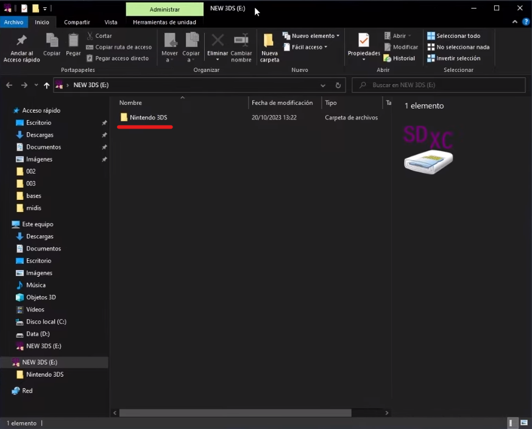

# Cómo hackear una 3DS desde cero
En esta guía no nos andaremos con explicaciones de que es un CFW o como funcionan los programas que usaremos.

Si has venido buscando explicaciones, búsca en [Google](https://google.com), aquí **solo** explicaremos la parte práctica de las cosas.

## 1. Requisitos para el hack
Si tu consola es del modelo NEW, necesitarás una tarjeta Micro SD. Normalmente ya deberías tener una.

Por el otro lado, si el modelo de tu consola es OLD, es decir, simplemente se llama Nintendo 3DS necesitarás una tarjeta SD o bien una micro SD con un adaptador de SD.

La capacidad que yo recomiendo para las tarjetas es de 32 GB (Gigabytes).

Además, necesitarás un ordenador en el que meter esa tarjeta y trabajar con ella.

**IMPORTANTE**: la tarjeta SD/MicroSD debe de haber sido utilizada por la consola al menos una vez. ¿Que qué quiero decir con esto? Que debe contener una carpeta llamada Ninendo 3DS. Esta carpeta se genera al momento de que la consola detecte la tarjeta por primera vez. Si la carpeta no existe, simplemente conecta la tarjeta a la 3DS y enciéndela. Aparecerá un mensaje que dirá que se están creando los datos del menú HOME. Cuando haya terminado, ya puedes apagar la consola y sacar la tarjeta.

**NUNCA SAQUES LA TARJETA MIENTRAS LA CONSOLA ESTÁ ENCENDIDA. PODRÍA RESULTAR EN UNA CORRUPCIÓN DE LA MEMORIA Y HACER QUE PIERDAS TEMPORALMENTE EL ACCESO A LA 3DS HACKEADA.**

## 2. Copiando archivos

¡Comencemos a hackear!

Lo primero que debemos hacer es meter nuestra tarjeta de memoria al ordenador.

Allí veremos una carpeta llamada Nintendo 3DS. Copiaremos la carpeta a algún lugar temporal, como el escritorio, ya que después la volveremos a poner en la tarjeta.

